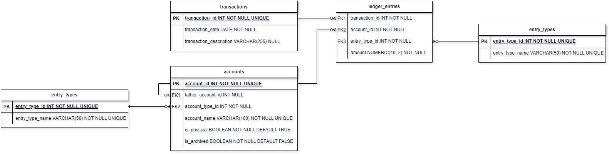

# WORK IN PROGRESS
# What is this?

This is a personal project to build a personal accounting solution. 
The main objectives of this solution are:
- Keep track of incomes.
- Keep track of expenses.
- Keep track of imaginary account balances*.
- Keep track of buys and sells of investments.
- Learn a bit about Accounting. 
- Create a user-friendly interface to record incomes and expenses.
- Learn to test a Flask app with Pytest.

_*Basically, I allocate my incomes to imaginary accounts, such as: Leisure Account, Emergency Fund Account, Training 
Account, etc. These are not related to a real Bank Account, as it would not be neither practical nor efficient to have 
that many bank accounts. It does not follow accounting laws, but it is not use for company accounting, but for personal
purposes, so it is not a problem._

Taken all these objectives into consideration, it makes sense to use double entry accounting method which is based 
on fundamental accounting equation:
```text
ASSETS = LIABILITIES + EQUITY + REVENUES - EXPENSES
```
Where:
- **Asset**: is a resource with economic value that an individual, corporation, or country owns. Such as: cash, houses,
cars...
- **Liability**: something a person or company owes, usually a sum of money.
- **Equity**: it is everything that belongs to the company’s shareholders (owners, investors): company’s shares, 
investments into the company, retained earnings, etc.
- **Revenues**: any incomes, such as sale of products. 
- **Expenses**: cost of operations that a company incurs to generate revenue. Such as buying raw material.

Each of these variables in the equation is formed by a hierarchy of accounts. This is usually called, 
[Chart of Accounts](https://en.wikipedia.org/wiki/Chart_of_accounts). For example purposes, my personal chart of 
accounts partially looks like:
* Assets
  * Imaginary Accounts
    * Landing Account
    * Usual Expenses Account
    * Leisure Account
    * Emergency Fund Account
* Incomes
  * Salary
    * Basic Salary
    * Bonus
* Expenses
  * Housing
    * Rent
    * Property Taxes
  * Food
    * Groceries
    * Restaurants
  * Leisure
    * Books

Each transaction is represented as 2 (or more) entries on the ledger corresponding to the variables in the equation. 
It has to be 2 entries by transaction so the equation is always balanced, that is why it is called double entry system.
When an entry to the ledger is an increase on the left side of the equation* it is a debit, when it is a decrease, it is
a credit. On the other side, when it is an increase on the right side of the equation it is a credit, and, when it is a 
decrease, it is a debit. So, each transaction will have at least one debit entry on the ledger and one credit entry on 
the ledger, being the amount of debits and credits equal for every transaction.  

_*Left side of the equation is formed by the assets and the expenses. Take into account that on the equation, as 
presented above, expenses are negative on the right side._ 

To try to clarify this, let's create some entries on the ledger:
1. It is the end of the month and our employer send us our salary (100u). This monthly payment is only related to our 
basic salary, no bonus. So it will be a credit on account Basic Salary, and a debit on Landing Account. We use Landing 
Account as a proxy to make recording easier.
2. Now is time to allocate the money to the useful accounts. So, there is a credit on Landing Account of 100u, a debit 
on Usual Expenses Account of 50u and a debit on Leisure Account of 50u.
3. A couple of days later is time to pay the rent. So there is a credit on Usual Expenses Account of 30u and a Debit on 
Rent account of 30u.
4. Finally on Saturday night we go to a restaurant. So there is a credit on Leisure Account of 10u and a debit on 
Restaurant Account of 10u.

| Transaction | Assets                                                                                | Liabilites | Equity | Revenues             | Expenses         |
|-------------|---------------------------------------------------------------------------------------|------------|--------|----------------------|------------------|
| 1           | Landing Account dr  100                                                               |            |        | Basic Salary cr 100  |                  |
| 2           | Landing Account cr 100 <br/> Usual Expenses Account dr 50 <br/> Leisure Account dr 50 |            |        |                      |                  |
| 3           | Usual Expenses Account cr 30                                                          |            |        |                      | Rent dr 30       |
| 4           | Leisure Account cr 10                                                                 |            |        |                      | Restaurant dr 10 |

The data model for this solution is highly inspired by 1
[Database for Financial Accounting Application II: Infrastructure](https://www.codeproject.com/Articles/5163401/Database-for-Financial-Accounting-Application-II).



PostgreSQL scripts can be found on folder PostgreSQL. Also, a Python-Flask application to create register into this 
Accounting Database can be found on this project. 

## Terraform
This solution is Deployed with Terraform as a standard service in App Engine(GAE). You will need to uncomment the 
enabling of the App Engine on main.tf if you have not done it before.

For further information in relation to the accounting database go to PostgreSQL/ReadMe.md. 
For further information in relation to the accounting Web App go to python/ReadMe.md.

# Bibliography
1. [Database for Financial Accounting Application II: Infrastructure](https://www.codeproject.com/Articles/5163401/Database-for-Financial-Accounting-Application-II)
 
